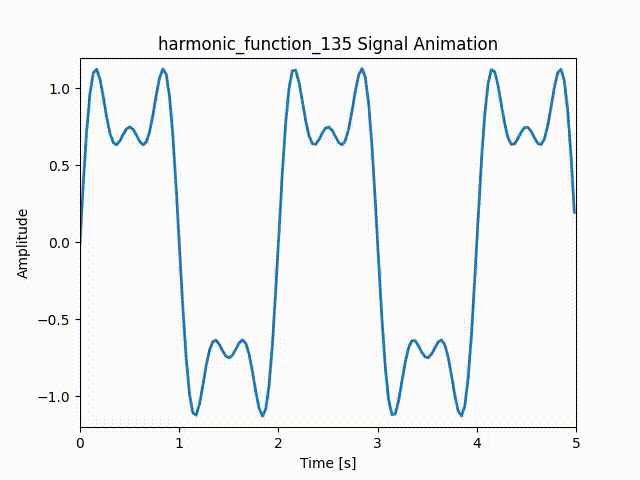
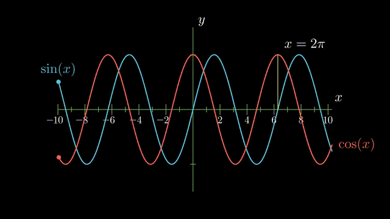

# VARIOUS ANIMATION USING MANIM AND MATPLOTLIB

### Graphical proof of A + B whole square

### Graphical proof of Pythagorous theorem

### Scrolling Harmonics

### HArmonics [1,3,5] Amplitude[1,0.5,0.25]

### Graphical plot of Sine and Cosine functions and point track
