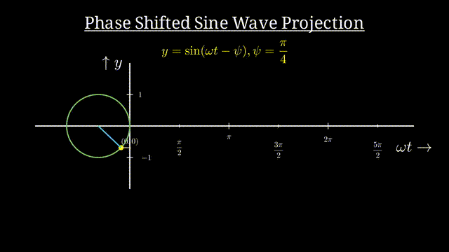

###### Project Information:
<!--- Badges --->

###### Metadata:
<!--- Badges --->

###### Documentation:
<!--- Badges --->

###### License:
<!--- Badges --->

# VARIOUS ANIMATION USING MANIM AND MATPLOTLIB

### Graphical proof of A + B whole square

### Graphical proof of Pythagorous theorem

### Set Operations

### Shifted Sine Wave projection

### Graphical plot of Sine and Cosine functions and point track

### Scrolling Harmonics

### Harmonics [1,3,5] Amplitude[1,0.5,0.25]

